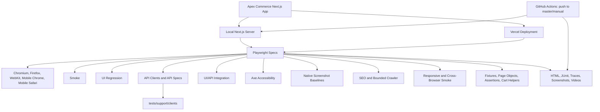

# Apex Commerce

Production-grade Next.js ecommerce platform built for large-scale URL discovery, SEO crawling, analytics testing, and performance benchmarking.

This repository is also a Quality Engineering portfolio project for senior QA, test automation, and test consulting roles. The automation strategy is risk-based and now includes smoke, regression, API, UI/API integration, accessibility, visual, SEO crawler, responsive, cross-browser, and master-branch CI quality gates.

## Live Website

[https://apex-website-three-bice.vercel.app](https://apex-website-three-bice.vercel.app)

## Stack

- Next.js 16 (App Router)
- React 19 + TypeScript
- Bootstrap 5 + React Bootstrap patterns
- MUI 6 (theme, ratings, skeletons)
- SEO: Metadata API, JSON-LD, sitemap.xml, robots.txt

## Quick start

```bash
npm install
npm run dev
```

Open [http://localhost:3000](http://localhost:3000).

## Quality Engineering Stack

- Playwright Test with TypeScript for UI, API, integration, SEO, responsive, and visual checks
- `@axe-core/playwright` for automated WCAG A/AA accessibility scans
- Native Playwright `toHaveScreenshot` visual regression
- Playwright HTML, list, and JUnit reporters
- GitHub Actions quality gate on push to `master`, with optional manual `workflow_dispatch`

## Test Architecture



## Test Commands

Install Playwright browsers once per machine:

```bash
npx playwright install
```

```bash
npm run test
npm run test:smoke
npm run test:e2e
npm run test:regression
npm run test:api
npm run test:integration
npm run test:a11y
npm run test:visual
npm run test:visual:update
npm run test:seo
npm run test:responsive
npm run test:cross-browser
npm run test:catalog
npm run test:search
npm run test:cart
npm run test:checkout
npm run test:headed
npm run test:debug
npm run test:report
npm run test:pr
```

Validation commands:

```bash
npm run lint
npm run typecheck
npm run build
```

Playwright reports are written to `playwright-report/`; JUnit output is written to `test-results/junit.xml`.
Traces, screenshots, videos, and visual diffs are written under `test-results/`.

Visual baselines are reviewed with `npm run test:visual` and intentionally updated with `npm run test:visual:update`.

## Documentation

- `docs/quality-strategy.md`
- `docs/product-risk-analysis.md`
- `docs/test-coverage-matrix.md`
- `docs/automation-architecture.md`
- `docs/ci-quality-gates.md`
- `docs/known-limitations.md`
- `docs/visual-regression.md`

## Crawler entry point

Start discovery at **`/crawler-test`** — exposes 1000+ internal links (products, categories, brands, filters, pagination, UTM variants, deep store paths).

## Catalog scale

| Entity      | Count |
|------------|-------|
| Products   | 520+  |
| Brands     | 55    |
| Categories | 30+ (nested paths) |
| Collections| 24    |
| Blog posts | 110   |

## Key routes

- `/products` — listing with query filters (`?category=&brand=&sort=&page=`)
- `/product/[slug]` — product detail + UTM query variants
- `/category/[...slug]` — nested categories
- `/brand/[slug]`, `/collection/[slug]`, `/blog/[slug]`
- `/search?q=` — search results
- `/store/[...path]` — deep nested store URLs
- `/sitemap` — HTML sitemap
- `/sitemap.xml` — XML sitemap
- `/robots.txt`

## Environment

Copy `.env.example` to `.env.local` and set `NEXT_PUBLIC_SITE_URL` for production canonical URLs.

Playwright uses `BASE_URL` when targeting a deployed or already-running environment:

```env
BASE_URL=http://localhost:3000
```

CI runs on push to `master` and optional manual dispatch only. Scheduled daily/monthly regression is intentionally not part of the accepted plan.

## Images

Product images use an explicit local image manifest with downloaded product assets mapped by product archetype and category. See `src/lib/images/product-image-manifest.json` and `src/lib/images/catalog-images.ts`.

## Vercel Deployment

This project is deployed on Vercel. To deploy from a local authenticated Vercel CLI session:

```bash
npm install
npm run build
npx vercel --prod
```

For production SEO/canonical URLs, set:

```env
NEXT_PUBLIC_SITE_URL=https://apex-website-three-bice.vercel.app
```

## Tracking Scripts

No third-party tracking scripts are loaded by default.

## Current Testing Status

Implemented coverage includes:

- Phase 1 smoke coverage for deployment-critical customer journeys and browser diagnostics.
- Phase 2 regression coverage for catalog, search, cart business rules, and simulated checkout UI behavior.
- Phase 3 API coverage for `/api/cart` and `/api/checkout`, plus UI/API cart total consistency.
- Phase 4 automated accessibility coverage with Axe and focused keyboard/form/name checks.
- Phase 5 Chromium-only visual regression using native Playwright screenshots.
- Phase 6 SEO metadata, structured data, sitemap, robots, invalid route, and bounded crawler coverage.
- Phase 7 responsive and cross-browser smoke coverage using existing Playwright projects.
- Phase 8 GitHub Actions quality gate on push to `master` or manual dispatch.
- Phase 9 documentation describing strategy, risk, coverage, architecture, CI, and limitations.

## Known Limitations

- Checkout is simulated; no real payment provider is exercised.
- Cart UI state is localStorage-backed; API-created state is seeded into localStorage for the integration test.
- Catalog data is generated/static mock data, not a live database.
- Automated Axe checks do not prove complete accessibility compliance.
- Visual regression is Chromium-only.
- Cross-browser coverage is representative smoke, not the full regression suite in every browser.
- CI is master-only/manual by design and has no scheduled workflow.
- Deployment positioning is Vercel-only. Firebase configs, scripts, and docs are intentionally absent.

## AI-Assisted Development Disclosure

This project was developed using AI-assisted engineering with Cursor. Product requirements, quality strategy, risk analysis, architectural decisions, test design, implementation review, and validation were directed and owned by the project author.
